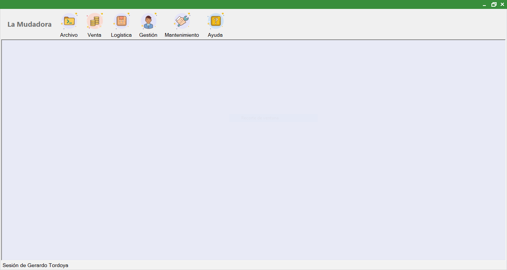

# La Mudadora 



**Pantalla principal del sistema: muestra el panel de control con acceso a las principales funcionalidades, como pedidos, facturación y despacho.**

---

Repositorio de GitHub para "La Mudadora": https://github.com/zherar7ordoya/TFC

```plaintext
USUARIO Y CONTRASEÑA INICIALES

Usuario:    admin
Contraseña: admin
```


## Índice

- [Motivación del proyecto](#motivación-del-proyecto)
- [Descripción](#descripción)
- [Herramientas de desarrollo](#herramientas-de-desarrollo)
- [Arquitectura](#arquitectura)
  - [Capas de la arquitectura](#capas-de-la-arquitectura)
  - [Patrones y componentes genéricos](#patrones-y-componentes-genéricos)
- [Casos de uso principales](#casos-de-uso-principales)
- [Dependencias del sistema](#dependencias-del-sistema)
- [Instalación del sistema](#instalación-del-sistema)
- [Configuración para desarrollo](#configuración-para-desarrollo)
- [Documentación](#documentación)
- [Licencia](#licencia)


## Motivación del proyecto

En un mercado donde la eficiencia y la organización son clave, las empresas de mudanzas suelen enfrentarse a retos como la gestión manual de órdenes, errores en la planificación logística y falta de visibilidad sobre los costos operativos. Este sistema busca abordar esas problemáticas mediante la digitalización de procesos críticos, como la captura de pedidos, la facturación y la asignación de recursos, optimizando así el flujo de trabajo y garantizando un servicio más ágil y confiable para los clientes.

Este sistema no solo optimiza la captura de pedidos y planificación logística, sino que también reduce significativamente el tiempo de asignación de recursos y minimiza los errores operativos, ofreciendo a los clientes una experiencia confiable y profesional.


## Descripción

Este proyecto es el **Trabajo Final de Carrera** (TFC) para la **Universidad Abierta Interamericana** (UAI) en la carrera **Analista Programador**.

- **Facultad**: Tecnología Informática  
- **Cátedra**:  Trabajo Final (T4-17-20)  
- **Ciclo**:    2023  
- **Docente**:  Maximiliano Bonaccorsi  
- **Alumno**:   Gerardo Tordoya  
- **Legajo**:   B00048241-T4  

El sistema está diseñado para la gestión de **venta** y **logística** en una empresa de mudanzas, con un enfoque en cuatro casos de uso principales: captura de pedidos, facturación, despacho, y liquidación (comisiones y reembolsos).


## Herramientas de desarrollo

- **Enterprise Architect** para el análisis y diseño orientado a objetos.
- **Visual Studio 2022** para la programación orientada a objetos.
- **Microsoft Office 2010** (apoyo)
- **Visual Studio Code** (apoyo)
- **Sandcastle** para la generación de documentación técnica.


## Arquitectura

El sistema sigue una arquitectura multicapa y está desarrollado en **.NET Framework 4.7.2**. La arquitectura base es **genérica**, lo que asegura flexibilidad y extensibilidad en futuras implementaciones. Además, el diseño está preparado para **inyección de dependencias**, aunque no fue implementada debido a las restricciones en el uso de librerías externas.


### Capas de la arquitectura

- **Capa Abstracta**
- **Capa Controladora (Vista)**
- **Acceso a Datos XML**
- **Gestor de Datos (CRUD)**
- **Entidades**
- **Lógica de Negocios**
- **Mapeadora Genérica**
- **Capa de Servicio**
- **Pruebas Unitarias**
- **Capa de Vista**


### Patrones y componentes genéricos

Uno de los logros más significativos del proyecto fue la implementación de una arquitectura base genérica, incluyendo:

- **Fábrica genérica**: Gobierna toda la solución, dejando el código preparado para inyección de dependencias.
- **Patrón multitón**: Implementado para el manejo del formulario de menú.
- **Mecanismo centralizado de manejo de excepciones**.
- **CRUD genérico**.
- **Persistidor XML genérico**.
- **Mapeador genérico**.
- **Clase base "forwader" genérica**.
- **Servicios genéricos**.


## Casos de uso principales

1. **Captura de pedidos**: Generación de órdenes de servicio.
2. **Facturación (Contado)**: Generación de facturas.
3. **Despacho**: Asignación de recursos (chofer, estibadores, insumos).
4. **Liquidación de comisiones y gastos de viaje**: Generación de liquidaciones.


## Dependencias del sistema

- **.NET Framework 4.7.2** o superior
- Sistema operativo Windows


## Instalación del sistema

Para instalar y usar el sistema, descargue la última versión del archivo instalador desde la sección de [releases](https://github.com/zherar7ordoya/TFC/releases) y siga las instrucciones del instalador. El instalador incluye todas las dependencias necesarias.


## Configuración para desarrollo

Si desea explorar o colaborar con el código fuente, siga estos pasos:

1. Clonar este repositorio:

 ```bash
git clone https://github.com/zherar7ordoya/TFC.git
 ```

2. Abre el archivo de solución (LaMudadora.sln) en Visual Studio 2022 o superior.
3. Asegúrate de tener instalado el .NET Framework 4.7.2 o superior.
4. Compila y ejecuta la solución desde el entorno de desarrollo.


## Documentación

El proyecto incluye documentación técnica generada con **Sandcastle**. Puedes acceder a la documentación HTML de manera navegable a través del siguiente enlace:

[Documentación Técnica en GitHub Pages](https://zherar7ordoya.github.io/TFC/)

Si prefieres explorar la documentación localmente, puedes encontrar los archivos HTML en el directorio `/docs` dentro del repositorio.


## Licencia

[![CC BY 4.0][cc-by-shield]][cc-by]

Este proyecto está bajo la Licencia
[Creative Commons Attribution 4.0 International License][cc-by].

[![CC BY 4.0][cc-by-image]][cc-by]

[cc-by]: http://creativecommons.org/licenses/by/4.0/
[cc-by-image]: https://licensebuttons.net/l/by/4.0/88x31.png
[cc-by-shield]: https://img.shields.io/badge/License-CC%20BY%204.0-lightgrey.svg
